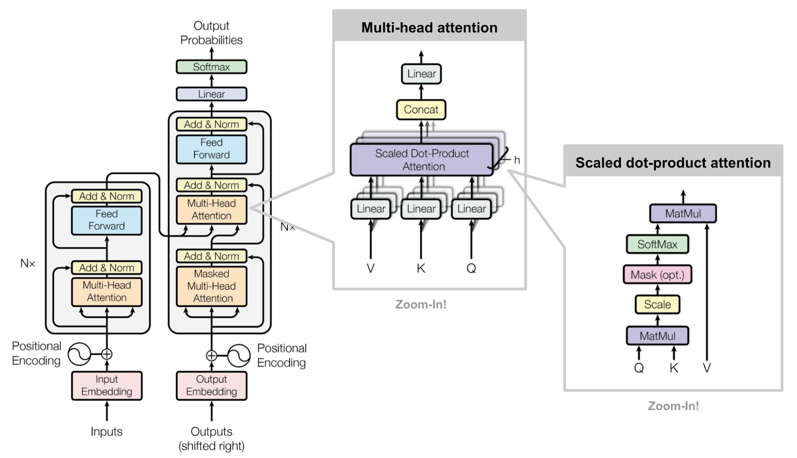

<h1 align="center">Generative AI</h1>

    

 

## **1. Pengertian Generative AI**

    

 

Generative Artificial Intelligence (Generative AI, GenAI, atau GAI) adalah kecerdasan buatan yang mampu menghasilkan `teks`, `gambar`, `video`, atau data lainnya menggunakan `model generatif`, seringkali sebagai respons terhadap input berupa `prompt`. Model-model Generative AI mempelajari pola dan struktur dari data training kemudian menghasilkan data baru yang memiliki karakteristik serupa.

Perkembangan Neural Network berbasis `Transformer`, khususnya Large Language Models (LLMs), memungkinkan terjadinya lonjakan dalam Generative AI pada awal tahun 2020-an. Beberapa contoh di antaranya adalah `chatbot` seperti ChatGPT, Copilot, Gemini, dan LLaMA, `teks-to-image` AI seperti Stable Diffusion, Midjourney, dan DALL-E, serta `text-to-video` AI seperti Sora. Perusahaan seperti OpenAI, Anthropic, Microsoft, Google, dan Baidu, serta banyak perusahaan kecil lainnya, terus bersaing dalam pengembangkan model Generative AI.

Generative AI memiliki aplikasi yang luas di berbagai industri, termasuk pengembangan perangkat lunak, perawatan dan kesehatan, finance, hiburan, customer service, sales dan marketing, seni, penulisan, fashion, dan desain produk. Namun, terdapat kekhawatiran mengenai potensi penyalahgunaan Generative AI, seperti dalam kejahatan siber, penggunaan berita palsu atau `deepfake` untuk menipu atau memanipulasi orang, copyrights para seniman, serta penggantian massal pekerjaan manusia.

 

## **2. Penggunaan Generative AI**

    

 

Penggunaan generative AI sangat luas dan beragam, memungkinkan otomatisasi serta meningkatkan efisiensi dan kualitas hasil di berbagai bidang. Berikut adalah beberapa contoh aplikasi Generative AI:

- **Seni dan Desain:** Generative AI dapat membantu seniman dan desainer untuk menciptakan karya seni yang unik, menghasilkan konsep desain yang baru, serta mengeksplorasi gaya dan komposisi baru.

- **Komposisi Musik:** Generative AI dapat menyusun musik orisinal, meremix komposisi yang ada, dan bereksperimen dengan genre dan gaya baru.

- **Pembuatan Konten:** Generative AI memfasilitasi pembuatan teks, gambar, dan video, mempercepat proses pembuatan konten dan memungkinkan pengalaman yang dipersonalisasi.

- **Dunia Virtual:** Generative AI digunakan untuk merancang dan mengisi dunia virtual dalam video game, simulasi, dan virtual reality.

- **Fashion dan Produk Desain:** Generative AI membantu menciptakan desain fashion baru, mengoptimalkan estetika produk, dan memprediksi tren fashion.

Selain itu, Generative AI juga digunakan dalam bidang lain seperti `healtcare` untuk pengembangan obat dan diagnosis penyakit, dalam `finance` untuk analisis data dan prediksi pasar, serta `customer service` untuk menyediakan respons otomatis yang lebih baik dan tepersonalisasi.

 

## **3. Discriminative vs Generative Model**

### **3.1. Discriminative Model**

    

 

Model `diskriminatif` adalah jenis model machine learning yang dapat digunakan untuk memprediksi label atau klasifikasi. Sebagai contoh, model diskriminatif dapat digunakan untuk memprediksi apakah sebuah gambar adalah kucing atau anjing. Model diskriminatif digunakan untuk memprediksi label output berdasarkan sekumpulan fitur pada input. Model ini mempelajari hubungan antara fitur input dan label output, kemudian menggunakan hubungan tersebut untuk membuat prediksi. Model diskriminatif sering digunakan untuk tugas `klasifikasi`, di mana tujuannya adalah untuk memprediksi ke kelas mana suatu instance termasuk. Secara umum, model diskriminatif lebih cocok untuk tugas klasifikasi.

### **3.2. Generative Model**

    

 

Model `generatif` menghasilkan variasi yang berbeda dari output yang diinginkan. Oleh karena itu, model generatif harus bersifat probabilistik. Berbeda daripada deterministik, yang akan menghasilkan output yang sama. Sebagai contoh, mengambil nilai rata-rata dari piksel dalam dataset training tidak akan berhasil. Model generatif perlu memiliki bagian acak yang mempengaruhi setiap output secara berbeda.

Ada dua jenis utama model generatif, yaitu `Generative Adversarial Networks` (GAN) dan `Variational Autoencoders` (VAE). GAN terdiri dari dua neural network, yaiut `generator` dan `diskriminator`. Keduanya saling bersaing untuk menghasilkan data yang realistis. VAE terdiri dari `encoder` dan `decoder`, yang bekerja sama untuk mengompres data menjadi variabel laten dan kemudian menghasilkan data baru dari variabel laten tersebut.

    

#### **3.2.1. Generative Adversarial Networks (GANs)**

GAN adalah model generatif yang belajar membuat data mirip seperti aslinya secara `adversarial`. `Adversarial` adalah suatu kondisi atau situasi di mana dua pihak saling bersaing atau berlawanan. GAN terdiri dari dua komponen, yaitu `Generator G` dan `Discriminator D`.

    

 

- **Discriminator**

  Memprediksi probabilitas sampel yang diberikan berasal dari dataset asli. Discriminator berfungsi sebagai kritikus dan dioptimalkan untuk membedakan sampel palsu dari yang asli.

- **Generator**
  Menghasilkan sampel sintetis berdasarkan input variabel noise yang membuat output menjadi beragam. Generator dilatih untuk menangkap distribusi data asli sehingga sampel yang dihasilkan bisa semirip mungkin dengan data asli, atau dengan kata lain, bisa menipu discriminator agar memberikan probabilitas yang tinggi.

Kedua model ini saling bersaing selama proses pelatihan. Generator berusaha keras untuk **menipu** Discriminator, sementara model kritikus (Discriminator) berusaha keras agar **tidak tertipu**. _[Permainan zero-sum](https://en.wikipedia.org/wiki/Zero-sum_game)_ yang antara dua model ini mengakibatkan keduanya untuk meningkatkan fungsionalitas mereka.

**Papers**:

- [**Generative Adversarial Networks**](https://arxiv.org/abs/1406.2661)
- [**How Generative Adversarial Networks and Their Variants Work: An Overview**](https://arxiv.org/abs/1711.05914)

#### **3.2.2. Variational Autoencoders (VAEs)**

- **Review Autoencoder**

  Autoencoder adalah neural network yang dirancang untuk mempelajari fungsi identitas secara unsupervised untuk merekonstruksi input asli sambil mengompresi data dalam proses tersebut sehingga dapat menemukan representasi yang lebih efisien dan terkompresi. Ide ini berasal dari tahun 1980-an, dan kemudian dipromosikan oleh makalah seminal oleh [**Hinton & Salakhutdinov, 2006**](http://citeseerx.ist.psu.edu/viewdoc/download?doi=10.1.1.459.3788&rep=rep1&type=pdf).

  Autoencoder terdiri dari dua neural network, yaitu:

  - **Encoder network:** Jaringan ini menerjemahkan input berdimensi tinggi ke dalam kode berdimensi rendah laten. Ukuran input lebih besar dari ukuran output.

  - **Decoder network:** Jaringan decoder mengembalikan data dari kode, dengan lapisan output yang semakin besar.

    

        
    

     

  Salah satu penggunaan Autoencoder adalah image denoising.
    

        
    

     

- **Variational Autoencoder**

  Secara singkat, VAE adalah autoencoder yang distribusi encoding-nya diatur selama pelatihan untuk memastikan bahwa ruang laten memiliki properti yang baik yang memungkinkan kita untuk menghasilkan data baru. Selain itu, istilah "variational" berasal dari hubungan erat antara regularisasi dan metode inferensi variansional dalam statistik.

    

        
    

     

  Supaya kita dapat menggunakan decoder dari autoencoder untuk tujuan generatif, kita harus memastikan bahwa ruang laten cukup teratur. Salah satu solusi yang mungkin untuk mendapatkan keteraturan tersebut adalah dengan memperkenalkan regularisasi eksplisit selama proses pelatihan. Dengan demikian, variational autoencoder dapat didefinisikan sebagai autoencoder yang pelatihannya diatur untuk menghindari overfitting dan memastikan bahwa ruang laten memiliki properti baik yang memungkinkan untuk proses generatif.

  Seperti autoencoder standar, variational autoencoder adalah arsitektur yang terdiri dari encoder dan decoder yang dilatih untuk meminimalkan kesalahan rekonstruksi antara data yang dienkode-dekode dan data awal. Namun, untuk menerapkan regularisasi pada ruang laten, kita perlu melakukan sedikit modifikasi pada proses encoding-decoding. Alih-alih mengkodekan input sebagai satu titik tunggal, kita mengkodekannya sebagai distribusi di ruang laten. Model ini kemudian dilatih sebagai berikut:

  - Pertama, input dikodekan sebagai distribusi di ruang laten.
  - Kedua, sebuah titik dari ruang laten diambil sampelnya dari distribusi tersebut.
  - Ketiga, titik yang diambil sampelnya tersebut didekodekan dan kesalahan rekonstruksi dapat dihitung.
  - Terakhir, kesalahan rekonstruksi dibackpropagate melalui jaringan.

    

        
    

     

- **Papers**:
  - [**An Introduction to Variational Autoencoders**](https://arxiv.org/abs/1906.02691)
  - [**Tutorial on Variational Autoencoders**](https://arxiv.org/abs/1606.05908)

 

## **4. Generative Pre-trained Transformers (GPTs)**

### **4.1. Transformer**

    

 

Transformer adalah arsitektur deep learning yang dikembangkan oleh Google berdasarkan mekanisme `multi-head attention`, yang diusulkan dalam paper tahun 2017 yang berjudul **"Attention Is All You Need"**. Teks dikonversi menjadi representasi numerik yang disebut `token`, dan setiap token dikonversi menjadi vektor melalui pencarian dari word embedding table. Pada setiap lapisan, token dikontekstualisasikan dalam jendela konteks dengan token lain melalui mekanisme `multi-head attention paralel` yang memperkuat sinyal untuk token kunci dan meminimalkan token yang kurang penting. Transformer tidak memiliki unit rekuren, sehingga memerlukan waktu pelatihan lebih sedikit dibandingkan arsitektur neural rekuren sebelumnya seperti `Long Short-Term Memory` (LSTM), dan telah banyak diadopsi untuk melatih `Large Language Model` (LLM) pada dataset besar seperti _korpus Wikipedia_ dan _Common Crawl_. Arsitektur ini digunakan dalam `Natural Language Processing` (NLP), Computer Vision, audio, dan pemrosesan `multi-modal`. Sistem pre-trained seperti `Generative Pre-trained Transformers`(GPT) dan `Bidirectional Encoder Representations from Transformers` (BERT) juga dikembangkan dari arsitektur ini.

### **4.2. Arsitektur Transformer**

    

 

#### **4.2.1. Encoder**

Encoder terdiri dari tumpukan N = 6 lapisan identik. Setiap lapisan memiliki dua sub-lapisan. Yang pertama adalah mekanisme `multi-head self-attention`, dan yang kedua adalah jaringan `feed-forward fully connected` secara posisi.

#### **4.2.2. Decoder**

Decoder juga terdiri dari tumpukan N = 6 lapisan identik. Selain dua sub-lapisan di setiap lapisan encoder, decoder menambahkan sub-lapisan ketiga, yang melakukan `multi-head attention` pada output dari tumpukan encoder.

#### **4.2.3. Multi-Head Attention**

`Multi-Head Attention` merupakan salah satu komponen kunci dalam arsitektur Transformer. Fungsinya adalah untuk memperbaiki kemampuan model dalam menangkap berbagai informasi dari urutan input pada berbagai posisi. Keuntungan dari Multi-Head Attention adalah bahwa ia memungkinkan model untuk fokus pada bagian yang berbeda dari urutan input secara bersamaan, menangkap berbagai konteks yang mungkin relevan untuk tugas tertentu.

#### **4.2.4. Scaled Dot-Product Attention**

`Scaled Dot-Product Attention` adalah mekanisme perhatian dasar yang digunakan dalam Multi-Head Attention. Scaled Dot-Product Attention dapat menangkap dependensi dan hubungan antar elemen dalam urutan input, memungkinkan model untuk fokus pada bagian yang relevan dari data input untuk menghasilkan output yang lebih informatif.

### **4.3. Generative Pre-trained Transformer**

    

 

Sebuah Generative-Pre-Trained Transformer adalah jenis model transformer yang dikembangkan oleh **OpenAI** untuk tugas-tugas natural language processing.`Generative` mengacu pada kemampuan model untuk menghasilkan teks. `Pre-Trained` mengacu pada proses pelatihan model yang terdiri dari dua tahap:

- **Pre-Training**: Model dilatih pada korpus teks yang besar, dengan tujuan untuk memprediksi kata berikutnya dalam sebuah kalimat.
- **Fine-Tuning**: Setelah model dilatih awal, model dapat disesuaikan pada tugas tertentu dengan dataset khusus dengan supervised learning.

 

Papers: [**Attention Is All You Need**](https://proceedings.neurips.cc/paper_files/paper/2017/file/3f5ee243547dee91fbd053c1c4a845aa-Paper.pdf)

Videos:

- [**But what is a GPT? Visual intro to transformers | Chapter 5, Deep Learning**](https://www.youtube.com/watch?v=wjZofJX0v4M&t=4sf)
- [**Attention in transformers, visually explained | Chapter 6, Deep Learning**](https://www.youtube.com/watch?v=eMlx5fFNoYc&t=810s)

 

<h2 align="center">Keperluan Magang</h2>

- Pengumpulan Magang : [**Form Pengumpulan**](https://forms.gle/xp69NmGizjwrCM8cA)
